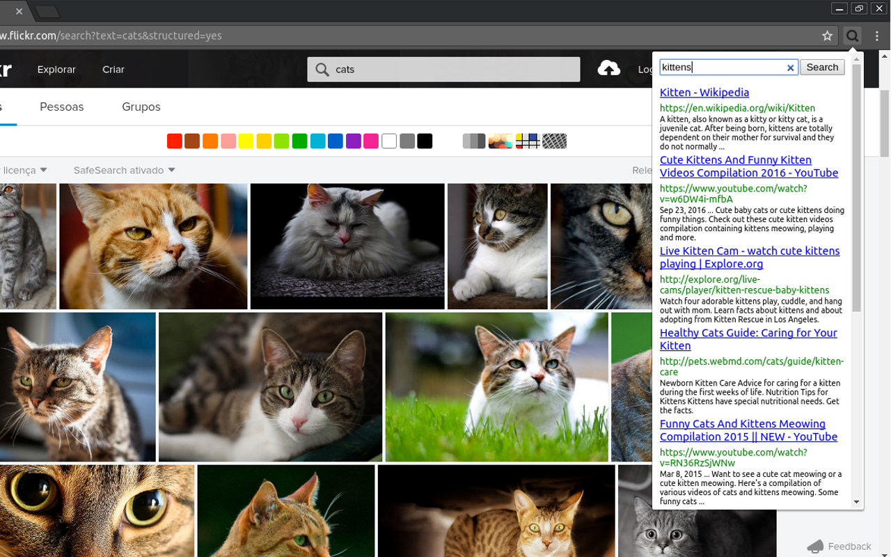

# searchbox
Google Chrome extension to make searchs without having to switch tabs.

This extension allows users to make a Google search without changing tabs, it displays a box at the top of the window, where the user can search and view search results. Default shortcut: Alt+S

To use the code, it is necessary to edit the variables "key" and "cx" in the file searchbox.js, and insert your Google Custom Seach API Key (https://developers.google.com/custom-search/json-api/v1/overview) and cx id (http://www.google.com/cse/manage/all).

